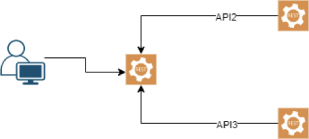

# OneStream_InterviewAssessment
A repository containing all the code related to an interview assessment for OneStream

## Questions
### 1. Build an example WebAPI that invokes 2 other WebAPIs 
- Calls should occur from the front-end WebAPI to the 2 back-end APIs in an Asynchronous manner
- Artificial delays can be introduced to mimic a longer running operation in API2 and API3
- Front-end Web API to support Get/Post verbs
- Be prepared to discuss options to secure front-end API 

### 2. Code Analysis: Explain why the block below does not emit “bow-wow”
```
class Animal
{
    public virtual string speak(int x) { return "silence"; }
}

class Cat : Animal
{
    public string speak(int x) { return "meow"; } // should be overridden because it hides the inherited member of Animal's speak method
}

class Dog : Animal
{
    public string speak(short x) { return "bow-wow"; } // should be overridden because it hides the inherited member of Animal's speak method 
                                                       // won't output "bow-wow" because the parent class's speak method wasn't overriden by the child class Dog
                                                       // need to update the method signature from speak(short x) to speak(int x) in order to override Animal's speak method
}

Animal d = new Dog(); 
Console.Write(d.speak(0)); 
```
> Answer: Dog's speak method should override Animal's speak method by adding the override keyword to the method signature. In addition, Dog's speak method should be changed from speak(short x) to speak(int x) in order to properly override Animal's speak method. The correct code is found in [Question2's](Question2/Dog.cs) Dog class.
### 3. Code Analysis: Outline any issues/concerns with the implemented code
```
class A
{
     public int a { get; set; }
     public int b { get; set; }
}

class B
{
    public const A a;  // A constant field in a class requires a value when being instantiated
    public B()  { a.a = 10; } // A is set as a constant above, so it cannot be set in B's constructor | Trying to access A's field of a will result in a NullReferenceException because it wasn't initialized
}

int main()
{
    B b = new B();
    Console.WriteLine("%d %d\n", b.a.a, b.a.b); // %d are for writing dates out to strings | b.a.b wasn't set in B's constructor, so it will return the default int value of 0
    return 0;
}
```
> Answer: `public const A a;` in Class A is wront because a constant field in a class requires a value when being instantiated. 
` public B()  { a.a = 10; }` is wrong because A is set as a constant above this line, so it cannot be set in B's constructor. Also, trying to access A's field of a will result in a NullReferenceException because it wasn't initialized.
`Console.WriteLine("%d %d\n", b.a.a, b.a.b);` will output %d %d because those are used to interpolate dates into string values. Since b.a.a and b.a.b are used as parameters in Console.WriteLine, you can use {0} and {1} to grab those values and output them to the console.

[Correct code for Class B](Question3/B.cs) 

[Correct code for the Main method](Question3/Program.cs)